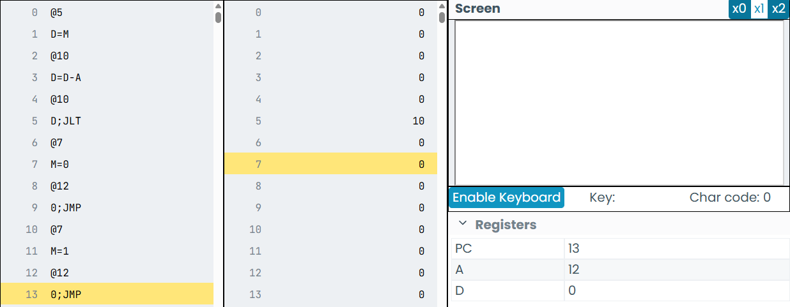
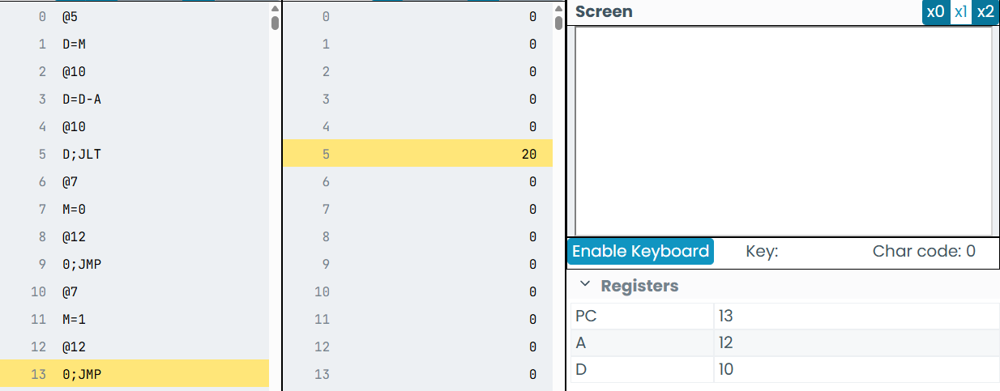
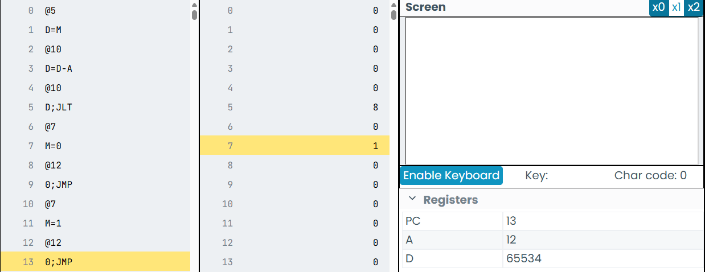

## Evidencias de la actividad 4 y su funcionamiento

cuando se prueba con 10

Cuando se prueba con un valor mayor que 10

Cuando probamos con un valor menor que 10 

En estas tres evidencias es posible confirmar que el programa cumple su funcionamiento, en el momento en el que en el espacio de memoria 5 hay un numero menor que 10 se escribe un 1 en el espacio de memoria 7, por otro lado si el numero es menor o igual que 10 se muestra un 0 en el espacio de memoria 7
