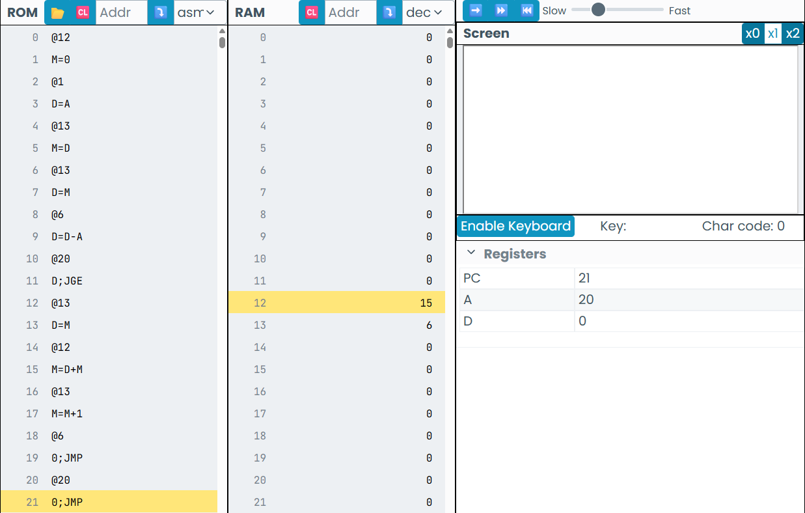

El resultado de la suma de los numeros del 1 al 5 debe ser igual a 15, en el código con ayuda de un contador y ciclos es posible llegar a este resultado 

El resultado fue correcto y en numero 6 en la casilla 13 representa el contador que llegará hats ael numero 5 y cuando se pase de 5 dejará de sumar