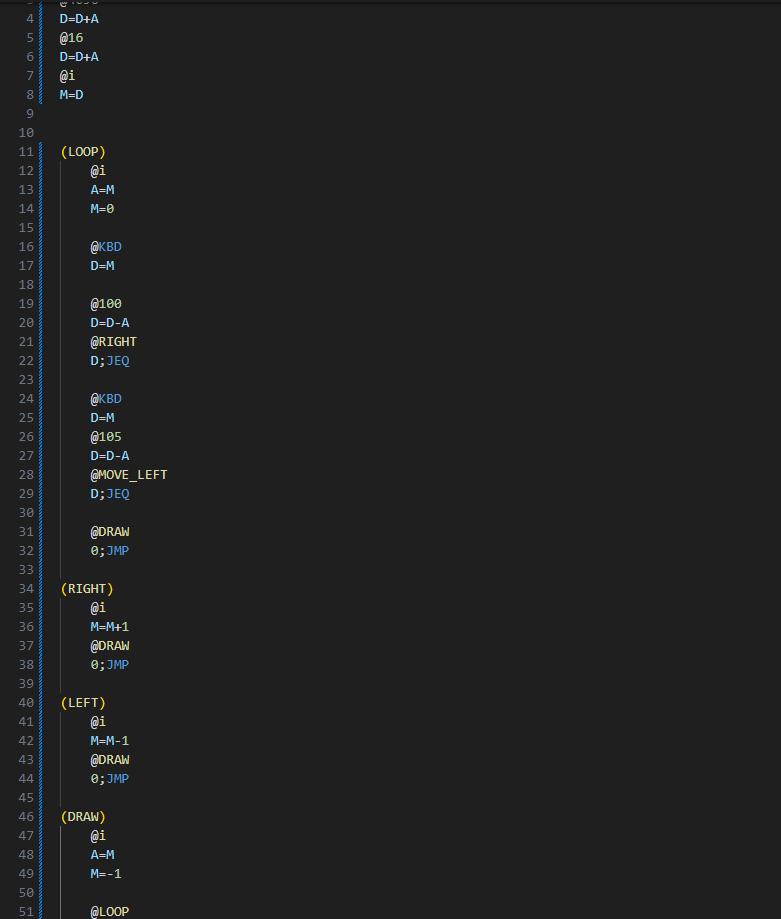
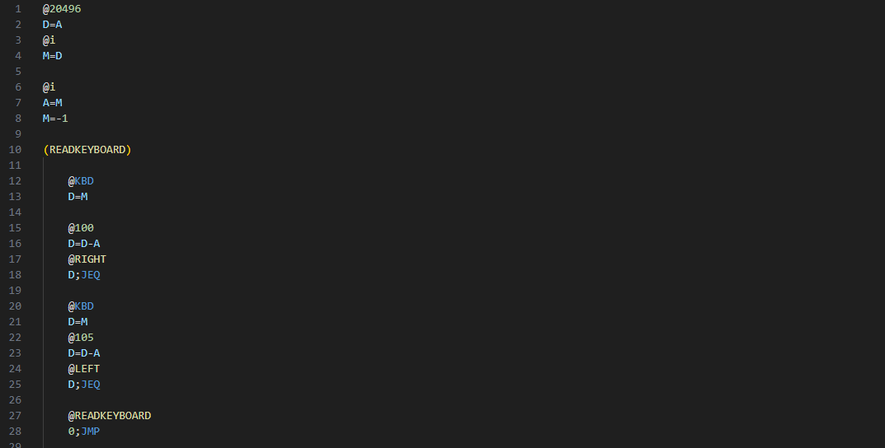
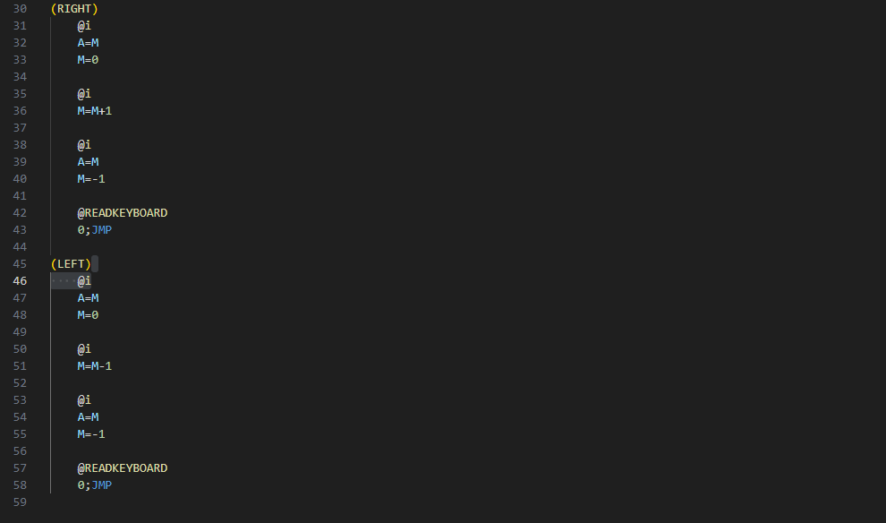

Modifica el programa de la actividad anterior de tal manera que puedas mover la línea horizontal de derecha a izquierda usando las teclas d e i respectivamente. Tu programa no tiene que verificar si la línea se sale de la pantalla.

Inicialmente tenemos que encontrar el valor central, en este caso, se calcula de la siguiente manera: 
16384 + (128*32) + 16 = 20496

## Pseudocódigo
RAM [20496] = -1
READ KEYBOARD
if  KBD = 0 
    go to READ KEYBOARD
if KBD = 105 
    RAM[20496] = 0
    RAM[20495] = -1

if KBD = 100 
    RAM[20496] = 0
    RAM[20497] = -1
go to READ KEYBOARD

intente ayudarme con ia y aunque el codigo si funcionaba no lo entendía tan bien 

Decidí leer el código y con ayuda de un compañero que me explicó, comprendí los conceptos y cambié algunas partes del código para pode comprenderlo mejor

