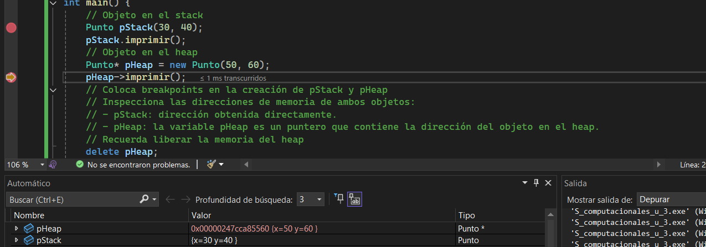

# Actividad 6

**1. ¿Cuál es la diferencia entre un constructor y un destructor en C++?**
El Constructor es la base de un objeto, en el código se ejecuta apenas creamos a p para darle los valores de 10 y 20. El Destructor es el que hace la limpieza, borara la información que se había almacenado previamente. 

**2. ¿Cuál es la diferencia entre un objeto y una clase en C++?**
La *Clase* es el plano, molde o plantilla. Define qué datos tendrá el objeto y qué acciones puede realizar, pero no ocupa espacio real en memoria para datos específicos. Un *Objeto*: Es la instancia de la clase. Este si guarda información por lo que ocupa un espacio real en la memoria

**3. ¿Qué diferencia notas entre el objeto Punto en C++ y C#?**
En C++, cuando se pone Punto p(10, 20), el objeto se creó de una vez ahí donde estaba. En C#, tuve que usar new. Sin el new, p no es nada. Esto pasa porque en C# los objetos siempre se guardan en el Heap

**4. ¿Qué es `p` en C++ y qué es `p` en C#? (en uno de ellos `p` es un objeto y en el otro es una referencia a un objeto).**
En C++, p ES el objeto. Si tú tocas a p, estás tocando directamente los datos de x e y.
En C#, p es una referencia. Es como si p fuera un papelito que tiene anotada la dirección de dónde vive el objeto realmente

**5. ¿En qué parte de memoria se almacena `p` en C++ y en C#?**
En C++, p se almacena en el Stack. En C#, la variable p está en el Stack, pero el objeto Punto con sus datos vive en el Heap.

**6. ¿Qué observaste con el depurador acerca de `p`? Según lo que observaste ¿Qué es un objeto en C++?**
Al inspeccionar p con el depurador, noté que en C++ p es simplemente un bloque de memoria que guarda dos números enteros (x e y).
Esto me enseñó que un objeto en C++ es básicamente un pedazo de memoria con un tamaño fijo. 

# Actividad 7

**1. Explicación de la diferencia entre objetos creados en el stack y en el heap.**
En el Stack el objeto se crea y se destruye automáticamente,por esto no es necesario destruirlo. En el Heap el objeto se crea manualmente y debe ser destruido a mano también en c++, si no son borrados se quedarán guardados


**2. `pStack` ¿Es un objeto o una referencia a un objeto?**
pStack es un objeto, ene este caso le está dando valores a una función que ya estaba previamente creada, pero no está referenciando ningun otro objeto,

**3. `pHeap` ¿Es un objeto o una referencia a un objeto? Si es una referencia, ¿A qué objeto hace referencia?**
pHeap es una referencia, es una variable que guarda una dirección de memoria. Hace referencia a un objeto de tipo Punto que fue creado en el Heap. 

**4. Observa en Memory1 (Debug->Windows->Memory->Memory1) el contenido de la dirección de memoria de `pHeap`, recuerda escribir en la entrada de texto de Memory1 la dirección de memoria de `&pHeap` y presionar Enter. Compara el contenido de memoria con el contenido de `pHeap` en la pestaña de Locals (Debug->Windows->Locals). ¿Qué observas? ¿Qué significa esto?**

# Actividad 8

**1. ¿Qué ocurre después de llamar a la función `cambiarNombre`? ¿Por qué aparece el mensaje `Destructor: Punto cambiado(70, 80) destruido.`?**
En este caso en el código la función cambiar nombre es un paso por valor, lo que significa que el cambio solo ocurrirá mientras se esté dentro de la función, al salir como ese dato no existirá más se llama el destructor inmediatamente para borrarla y continuar usando la original

**2. ¿Por qué `original` sigue existiendo luego de llamar `cambiarNombre`?**
Original se mantiene en el código porque está guardada permanentemente y en ningún momento fue destruida por lo que cuando se salga de la función cambiar nombre el objeto volverá a su estado original como si nunca le hubieran cambiado el nombre.

**3. ¿En qué parte del mapa de memoria se encuentra `original` y en qué parte se encuentra `p`? ¿Son el mismo objeto? (recuerda usar siempre el depurador para responder estas preguntas).**
Tanto original como p se encuentran en el Stack, pero en direcciones de memoria distintas. original reside en el marco de memoria de main, mientras que p reside en el marco de la función cambiarNombre. No son el mismo objeto.

Modifica la función `cambiarNombre`:

`void cambiarNombre(Punto& p, string nuevoNombre) {  p.name = nuevoNombre;}`

**1. ¿Qué ocurre ahora? ¿Por qué?**
Al añadir & se está cambiando lo que mencioné anteriormente, en este caso ya no sería un paso por valor si no por referencia lo que significa que el valor será sustituido en la variable original, pues está haciendose una referenciacion a la variable original y modificandola.

Modifica ahora a `cambiarNombre` y a `main`

**1. ¿Qué ocurre ahora? ¿Por qué?**
En este caso es un paso por puntero, se llama el espacio de memoria donde está guardada la variable original y se cambian directamente los valores qyue están almacenados en este por lo que el cambio será directamente en la variable original. 

**2. En este caso ¿Cuál es la diferencia entre pasar un objeto por valor, por referencia y por puntero?**
*Paso por Valor (Punto p):* Se crea una copia independiente. Los cambios se borran cuando se sale de la función y se ejecuta el destructor de la copia. El original no se ve afectado.

*Paso por Referencia (Punto& p):* Es un alias de la original. No hay copia ni nueva memoria para el objeto, la función trabaja directamente sobre el original.

*Paso por Puntero (Punto* p):* Se pasa la dirección de memoria y se modifica directamente en esta misma, al igual que en la anterior se cambian los valores en la original.

# Actividad 9

**1. ¿Qué puedes concluir de los miembros estáticos y de instancia de una clase en C++? ¿Cómo se gestionan en memoria? ¿Qué ventajas y desventajas tienen? ¿Cuándo es útil utilizarlos?**
Los miembros estáticos son muy utiles cuando es necesario poder ir modoficando el vaalor de una variable, por ejemplo en unc ontador es necesario que cada que aumente esa información se mantenga guardada en la variable, por otra parte los valores de instancia son bastante útiles cuando quiero conservar una acción, por ejemplo en el código en la función incrementar es bastante útil que el valor almacenado en la variable que no es estática vuelva a su valor original al salir de la función pues esto nos permite repetir el proceso de sumar 1 al valor que entre sin importar cual sea. El valor de la variable estática se mantendrá por lo que tiene como ventaja que es posible ir modificando su valor y que vaya guardandolo, la desventaja será que si quiero volver al original tendrpia que realizar un proceso largo para borrar las acciones realizadas antes, mientras que el de la variable que no es estática volverá a su forma original y se borrará la información que guarda, la ventaja es que si necesito conservar el valor original será bastante útil pues lo puedo usar como un numero fijo, la desventaja es que no conservaré valores que use dentro de una función con esta variable.

**2. En el programa, en qué segmento de memoria se están almacenando c1, c2, c3 y Contador::total? Ten especial cuidado con la respuesta que das para el caso de c3, piensa de nuevo, qué es c3 y qué está almacenando. Ahora, responde de nuevo, en qué segmento de la memoria se está almacenando c3 y en qué segmento de la memoria se está almacenando el objeto al que apunta c3.**

# Actividad 9

**1. Explica el ciclo de vida de un objeto en el stack versus uno en el heap.**
Un objeto creado en el stack se va a crear, se le asignará su información correspondiente y finalmente cuando ya no vaya a ser usado se borrará de manera automática liberando el espacio de memoria que estaba ocupando, por otra parte un objeto en el heap va a ser creado, realizará las acciones necesarias y solo se borrará cuando se le indique, o sea solo puede ser borrado manualmente, y si no es borrado se mantendrá ahi. 

*Después de la modificación*

**1. ¿Compila? ¿Por qué ocurre esto?**
No es posible compilar debido a que aparece un error, la variable `pBloque2` está almacenada en unos corchetes por lo que solo existe dentro de ellos, cuando quieren llamarla por fuera no es posible porque la variable no existe en ese espacio, por lo mismo no será posible utilizarla allí. 

**2. Modifica el programa para declarar `pBloque2` por fuera del bloque, pero inicializarlo dentro del bloque. ¿Qué ocurre? ¿Por qué?**
En este caso si es posible utilizarlo por fuera de los corchetes pero también por dentro, esto debido a que la variable está siendo declarada por fuera de los corchetes, será una variable a la cual ambos podrán acceder.

*Después de la modificación*

**1. ¿Por qué el objeto `pBloque` se destruye al salir del bloque y `pBloque2` no? Recuerda de nuevo, `pBloque2` es un objeto o es una referencia a un objeto?**
el objeto `pBloque` está almacenado en el stack, será una variable que cumple su propósito y cuando termine se borrará inmediatamente, por otra parte `pBloque2` está creado utilizando *new*, y está declarado como punto* por lo que será una referencia a un objeto y no directamente el objeto, esto significa que debe ser borrado manualmente y no se borrará automáticamente.

**2. ¿En qué parte de la memoria se almacena `pBloque2`?**
Está almacenado en el stack, pues es una variable local -> ```pBloque2 = new Punto(500, 600); ``` sin embargo el valor que está referenciando o sea new punto si estará almacenado en el el heap, por esto no se borrará inmediatamente

**3. ¿En qué parte de la memoria se almacena el objeto al que apunta `pBloque2`?**
