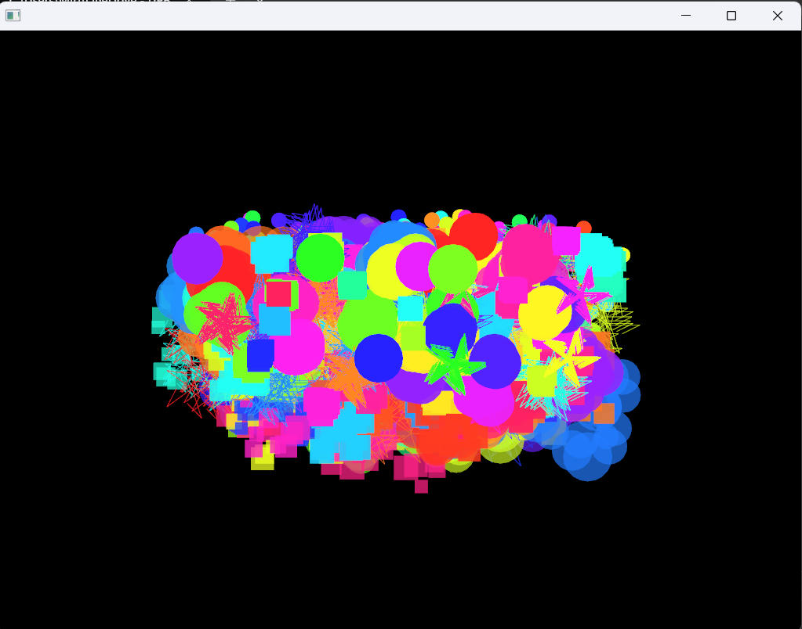
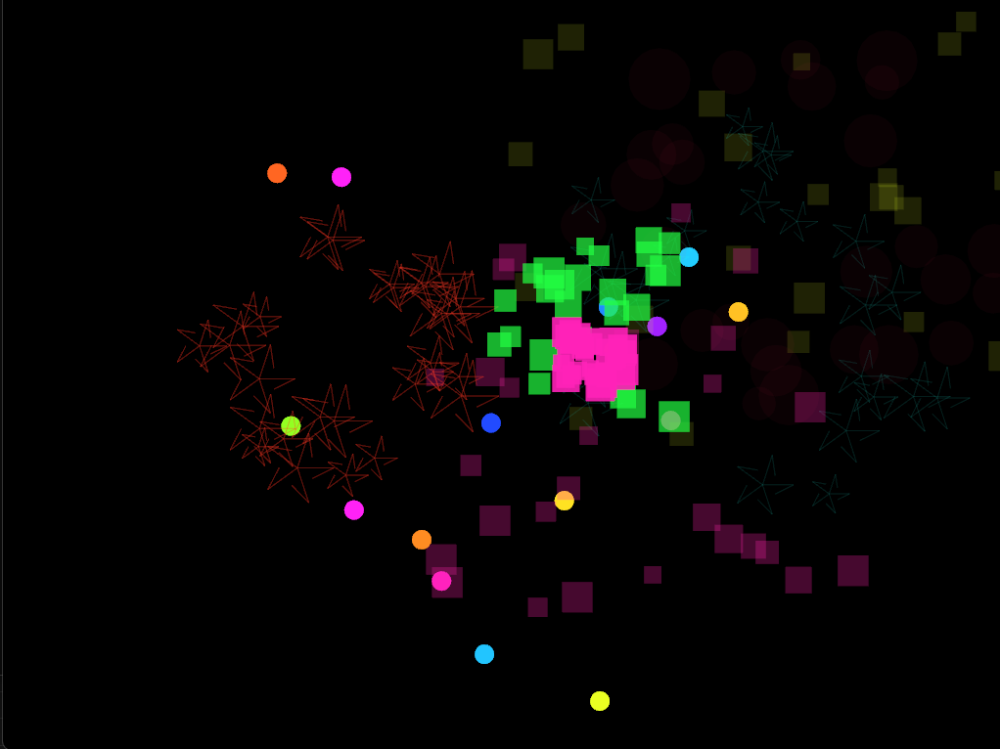
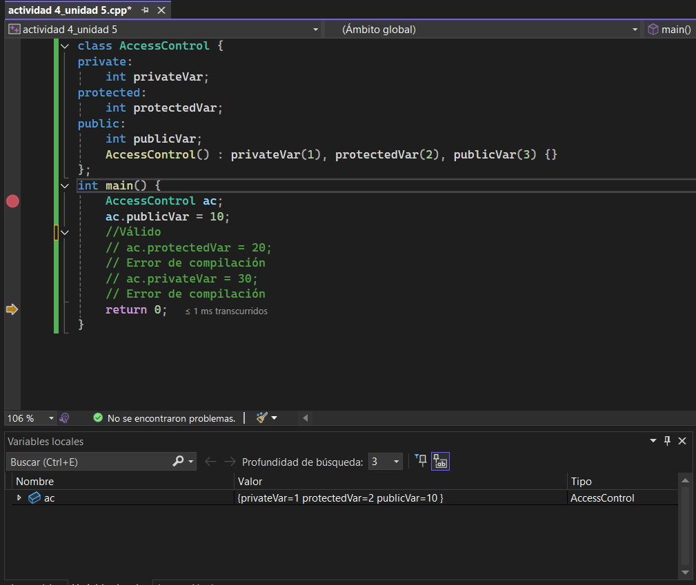

# Actividad 1

**1. ¿Qué es el encapsulamiento para ti? Describe una situación en la que te haya sido útil o donde hayas visto su importancia.**

El encapsulamiento consiste en definir el nivel de protección que tiene un objeto, lo que significa que podemos determinar si será una clase *pública*, a la que todos puedan acceder, *privada* que solo se puedaa acceder dentro de ella, o *protegidas* que se pueda acceder a ellas por medio de herencia. 

Al momento de utilizar variables de una clase padre en las clases hijas es muy util poder modificar la información desde estas sin comprometer la seguridad de las variables creadas.

**2. ¿Qué es la herencia? ¿Por qué un programador decidiría usarla? Da un ejemplo simple.** 

La herencia es una parte de POO que consiste en crear una clase padre o principal que contenga atributos generales que el programador necesite usar en vafias clases, como crear una plantilla que luego podrá ser utilizada en otras clases, lo que significa que los atributos originaes podrán modificarse en cada clase. 

un programador podráia decidir usarla porque es mucho más fácil tener una plantilla para las clases que deben crearse que tener que asignarle sus valores cada que se crea una nueva. 

un ejemplo puede ser crear una clase padre que sea **mascotas** con características como numero de patas, alimentacion, tipo de animal, sonido ... y luego crear clases hijas como gato, perro, hamster, ... y a cada uno asignarle características específicas

**3. ¿Qué es el polimorfismo? Describe con tus palabras qué significa que un código sea “polimórfico”.**

El polimorfismo es la capacidad de una subclase que hereda de una clase más general de responder de forma diferente al mismo método, siguiendo con el ejemplo anterior si tengo la clase mascotas y tengo perro y gato, si creo la función *hacer sonido*, cuando la llame en perro va a hacer *guau* y cuando llame gato va a hacer *miau*

## Parte 2: alaisis del código de csharp

**Encapsulamiento:**

**- Señala una línea de código que sea un ejemplo claro de encapsulamiento y explica por qué lo es.**

**- ¿Por qué crees que el campo nombre es private pero la propiedad Nombre es public? ¿Qué problema se evita con esto?**

```csharp
private string nombre; 
public string Nombre 
{
    get { return nombre; }
    protected set { nombre = value; }
}
```
Inicialmente es una variable privada pues esta es la que almacena el dato real/original, la propiedad Nombre toma el dato original y crea una copia de este mismo al que se puede acceder publicamente y puede ser modificado por todos pero el dato original no va a ser modificado directamente. El get y set se utilizan para crear la copia, get para que cualquiera pueda leerlo pero el set establece que será protegido por lo que solo las clases que lo hereden podrán usarlo

**Herencia:**

**- ¿Cómo se evidencia la herencia en la clase Circulo?**

**- Un objeto de tipo Circulo, además de Radio, ¿Qué otros datos almacena en su interior gracias a la herencia?**

```csharp
public class Circulo : Figura
{
    public double Radio { get; private set; }
    public Circulo(double radio) : base("Círculo")
    {
        this.Radio = radio;
    }
    public override void Dibujar()
    {
        Console.WriteLine($"Dibujando un {Nombre} de radio {Radio}.");
    }
}

```
Desde que se define la clase al poner circulo: figura se está estableciendo una relación de herencia entre ambas. La clase circulo heredará la propiedad de el nombre por lo que al definirla será necesario especificar el nombre, esto se evidencia en `public Circulo(double radio) : base("Círculo")` donde se está llamando en constructor de formas, además también heredará la función de dibujar, que aunque no tiene especificada su función, si podremos definir que hará específicamente en la clase circulo

**Polimorfismo:**

**- Observa el bucle `foreach`. La variable `fig` es de tipo Figura, pero a veces contiene un Circulo y otras un Rectangulo. Cuando se llama a `fig.Dibujar()`, el programa ejecuta la versión correcta. En tu opinión, ¿Cómo crees que funciona esto “por debajo”? No necesitas saber la respuesta correcta, solo quiero que intentes razonar cómo podría ser.**

```csharp
public static void Main()
{
    List<Figura> misFiguras = new List<Figura>();
    misFiguras.Add(new Circulo(5.0));
    misFiguras.Add(new Rectangulo(4.0, 6.0));
    misFiguras.Add(new Circulo(10.0));
    foreach (Figura fig in misFiguras)
    {
        fig.Dibujar();
    }
}
```
Debido que al recorrer el arreglo creado la función dibujar se va a encontrar con las figuras que están definidas, en la posición 0 se encontrará con un circulo, así que irá a la clase circulo, revisará como debe ejecutarse y luego pasará a la siguiente posición del arreglo, que tendrá una figura diferente. 

## Parte 3: hipótesis sobre la implementación

**1. Memoria y herencia: cuando creas un objeto Rectangulo, este tiene Base, Altura y también Nombre. ¿Cómo te imaginas que se organizan esos tres datos en la memoria del computador para formar un solo objeto?**

Se almacenan en un mismo bloque o espacio en la memoria, crreo que estarían uno dentrás de el otro almacenando primero los de figura y luego los de rectángulo, para especificar cuales son parte de la clase padre y cuales son parte de la clase hijo

**2. El mecanismo del polimorfismo: pensemos de nuevo en la llamada fig.Dibujar(). El compilador solo sabe que fig es una Figura. ¿Cómo decide el programa, mientras se está ejecutando, si debe llamar al Dibujar del Circulo o al del Rectangulo? Lanza algunas ideas o hipótesis.**

Como mencioné anteriormente creo que al recorrer el arreglo fig le asignará que objeto hijo se está llamando, dentro del arreglo se están creando nuevas figuras que ya tienen establecidos sus valores por lo que al recorrerlo fig va a tener que tomar la función dibujar y buscar en que figura debe dibujar, y allí tomará la figura especificada en el espacio del arreglo. 

**3. La barrera del encapsulamiento: ¿Cómo crees que el compilador logra que no puedas acceder a un miembro private desde fuera de la clase? ¿Es algo que se revisa cuando escribes el código, o es una protección que existe mientras el programa se ejecuta? ¿Por qué piensas eso?**
Pienso que es una protección que existe desde que se corre el código, inmediatamente el acceso a esta clase se bloquea y no es posible editarla


## Actividad 2



Básicamente el código crea inicialmente la particula que saldrá desde la mitad de la pantalla, especifica su duración, su movimiento y como acabará, en esta parte se crea la clase `ExplosionParticle` que será la clase padre de 3 subclases que serán: *CircularExplosion, RandomExplosion, StarExplosion*, estas tres clases heredarán las características de `ExplosionParticle` pero también tendrán ciertas especificaciones párticulares de cada clase, todo esto pasa en el **ofApp.h**

Luego en el **ofApp.cpp** el código llama a estas subclases en una función que se llama cuando las partículas deben explotar, también las borrará cuando terminen, se crearán las particulas en la parte inferior con leves variaciones en su posición, se establece un tiempo de vida y un color random

## Actividad 4

antes de quitar las comentadas si es posible cambiar el valor de las variables
