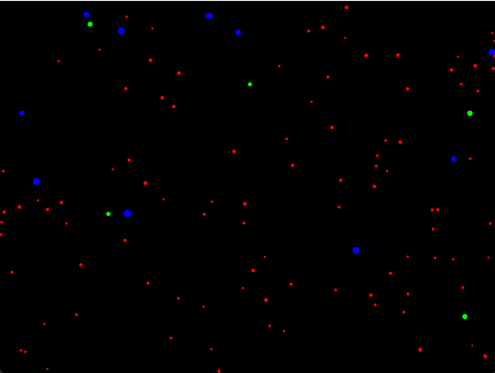
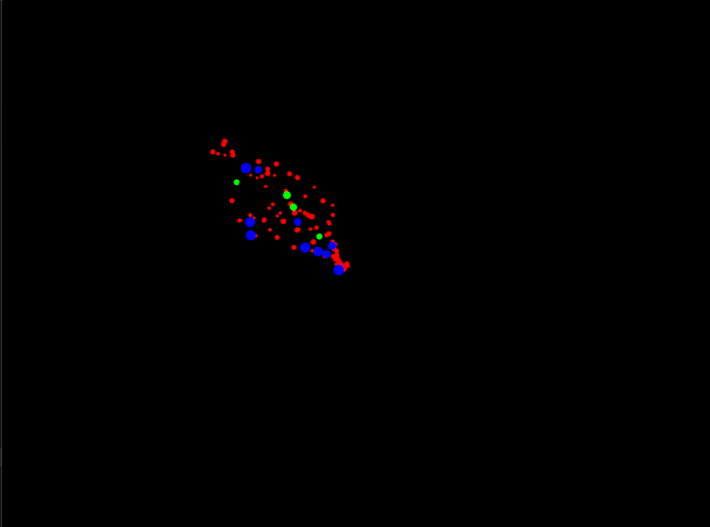
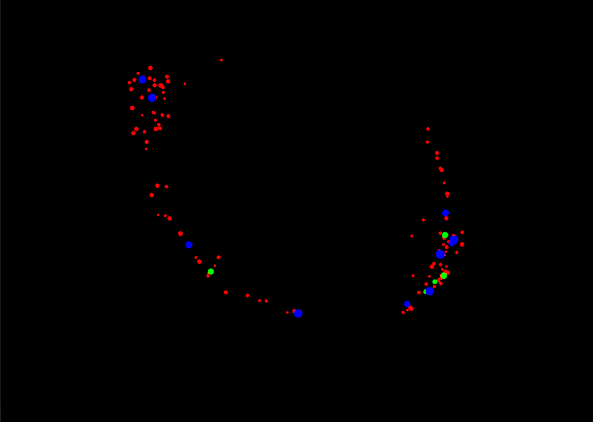
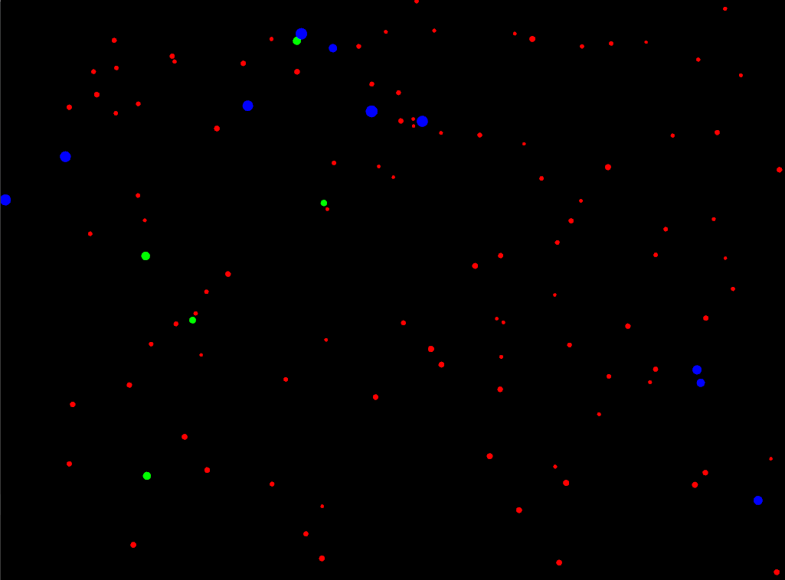
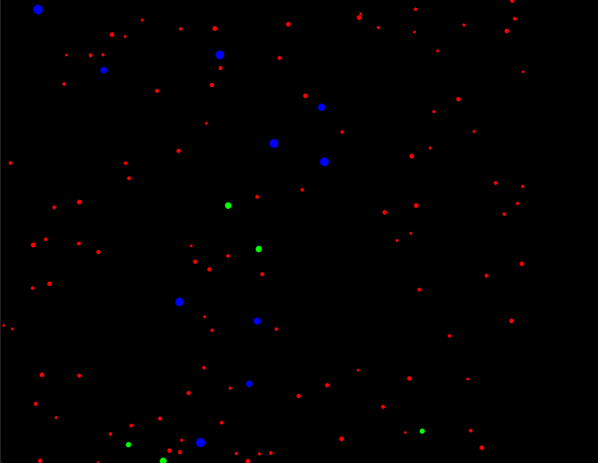

# Actividad 1

refactoring.guru patrones de diseño

Virtual en el código significa que es una calse abtrsacta, o sea que no se va autilizar en esta fase si no como una interfaz, sí se debe implementar en cada clase

Observer es una clase virtual
sujeto: 
AddObserver añadir suscriptor
remove Observer quietar suscriptor
Notify está para notificaciones


Particle
hereda de observer por lo que debe tener los metodos de esta misma, ambos sobreescritos, pero además tiene sus propios métodos

Basicamente en ve de crear ifs se crean funciones que serán llamadas en eventos específicos y esto permite mayor seguridad al momento de crear código

**1. ¿Cómo puedes interactuar con la aplicación? Menciona específicamente las teclas y qué efecto parecen tener sobre las partículas.**
La letra *S* detiene las particulas de cualquier movimiento que estén realizando sin importar el estado en el que estén 
La letra *A* atrae las teclas al mouse aunque este se muve 
La letra *R* las repele de el mouse
La letra *N* las devuelve a la normalidad o se a su movimiento inicial

**2. ¿Observas los diferentes tipos de “partículas”? ¿Se comportan todas igual inicialmente?**
No, aunque algunas particulas tengan comportamientos iguales, algunas se mueven más rápido, otras más lento, tienen diversos movimientos en diferentes direcciones


**3. Toma algunas capturas de pantalla de la aplicación en diferentes momentos (estado inicial, después de presionar ‘a’, ‘r’, ‘s’, ‘n’) y añádelas a tu bitácora.**

*A*


*R*


*S*


*N*


**4. ¿Qué crees que está pasando “detrás de cámaras” cuando presionas las teclas? Formula una hipótesis inicial sobre cómo la aplicación cambia el comportamiento de las partículas.**

Yo pienso que usando el notify se envian notificaciones del cambio de estado a todas las particulas, especialmente por la suscripción que ocurre en esta parte del código:

```cpp
void ofApp::setup() {
	ofBackground(0);
	particles.reserve(100 + 5 + 10);
	for (int i = 0; i < 100; ++i) {
		Particle* p = ParticleFactory::createParticle("star");
		particles.push_back(p);
		addObserver(p);
	}
	for (int i = 0; i < 5; ++i) {
		Particle* p = ParticleFactory::createParticle("shooting_star");
		particles.push_back(p);
		addObserver(p);
	}
	for (int i = 0; i < 10; ++i) {
		Particle* p = ParticleFactory::createParticle("planet");
		particles.push_back(p);
		//addObserver(p);
	}
}
```
Haciendo pruebas si comentamos la linea addObserver en la particula planet las particulas que pertenecen a esta no cambiarán de estado