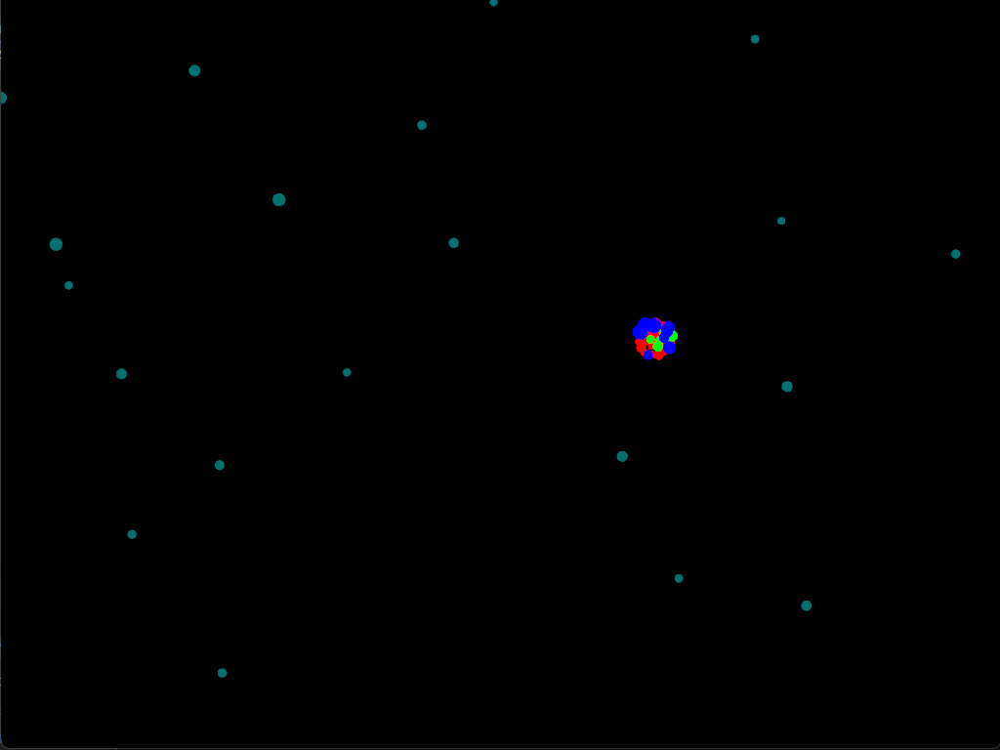
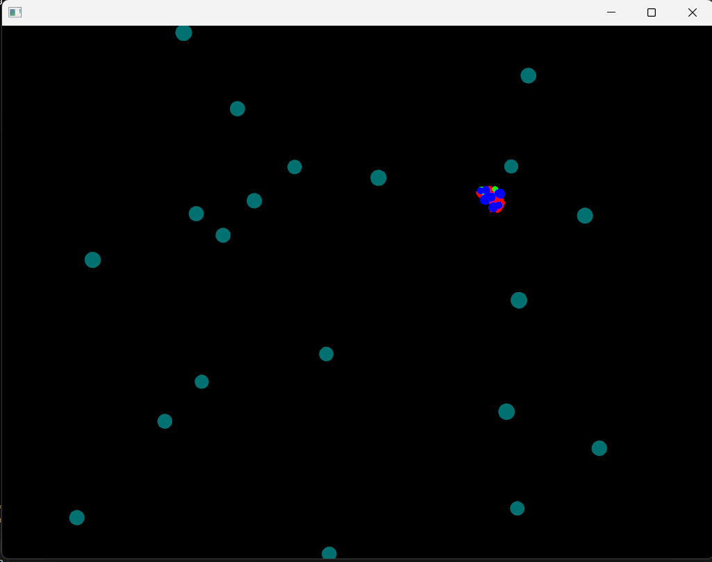

# Actividad 5

## 2. Explica cómo usaste el patrón Factory para esta nueva partícula.
El patrón factory lo utilicé en esta parte, se crea la nueva particula y se le asignan sus características, en esta parte solamente se asigna el nombre y la forma en la que se verá, no la cantidad ni el comportamiento

Particle* ParticleFactory::createParticle(const std::string& type)
```cpp
else if (type == "MilkyWay") {
		particle->size = ofRandom (10.0f, 12.0f);
		particle->color = ofColor(0, 112, 112);
	}
```

El código completo de esa sección se vería asi: 

```cpp
Particle* ParticleFactory::createParticle(const std::string& type) {
	Particle* particle = new Particle();
	if (type == "star") {
		particle->size = ofRandom(2.0f, 4.0f);
		particle->color = ofColor(255, 0, 0);
	}
	else if (type == "shooting_star") {
		particle->size = ofRandom(3.0f, 6.0f);
		particle->color = ofColor(0, 255, 0);
		particle->velocity *= 3.0f;
	}
	else if (type == "planet") {
		particle->size = ofRandom(5.0f, 8.0f);
		particle->color = ofColor(0, 0, 255);
	}
	else if (type == "MilkyWay") {
		particle->size = ofRandom (10.0f, 12.0f);
		particle->color = ofColor(0, 112, 112);
	}
	return particle;
}
```

## 3. Describe cómo implementaste el patrón Observer para esta nueva partícula.

El patrón observer está en la parte de aadir o eliminar suscriptores, si no se agrega el observador no responderá a los estados creados

En el setup: 
```cpp
for (int i = 0; i < 20; ++i) {
	Particle* p = ParticleFactory::createParticle("MilkyWay");
	particles.push_back(p);
	addObserver(p);
}
```

## 4. Explica cómo aplicaste el patrón State a esta nueva partícula.
Las particulas al ser añadidas como observadores responderán a los mismos estados que el resto de particulas, pero si no, simplemente estarán respondiendo al estado normal y moviendose por el espacio

primer intento, quise hacerlos muy pequeños pero sentí que no se notaban 



luego los hice más grandes 

