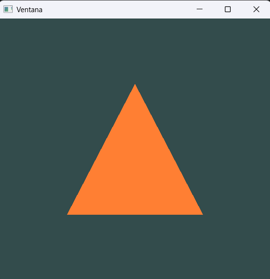
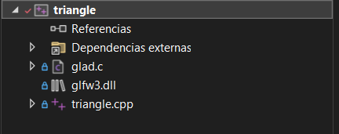
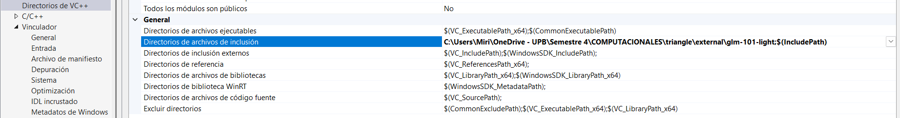
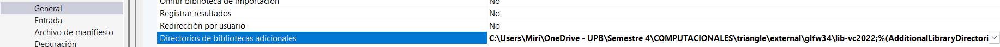
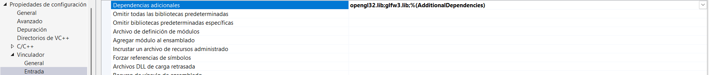

# Actividad 1
🧐🧪✍️ Reporta en tu bitácora
1. Incluye una captura de pantalla del ejemplo funcionando en tu máquina.

2. Observa el proyecto, trata de entenderlo, pero ten presente que lo analizaremos más adelante.

3. ¿Qué preguntas te surgen al ver el código?. Anota al menos tres preguntas que te gustaría investigar más adelante (no te preocupes que la idea de esta unidad es que las resuelvas).

¿Qué es un shader?
¿Qué es un GLFW?
¿Qué es un VAO o VBO?

## Actividad: 

Archivos de inclusion 

Directoriio de .Lib

Dependencias

